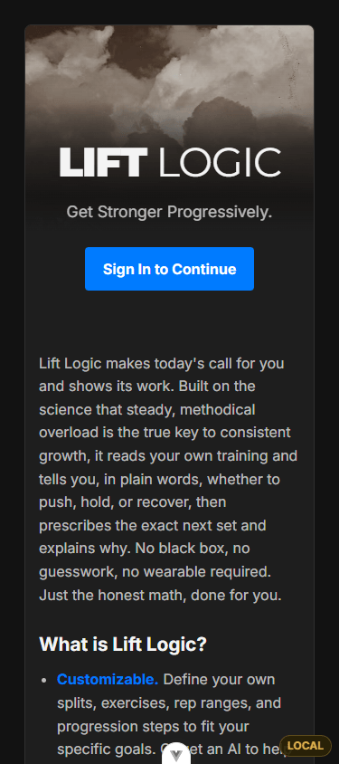
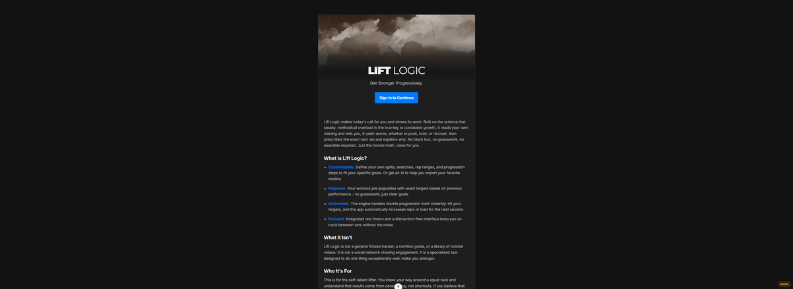
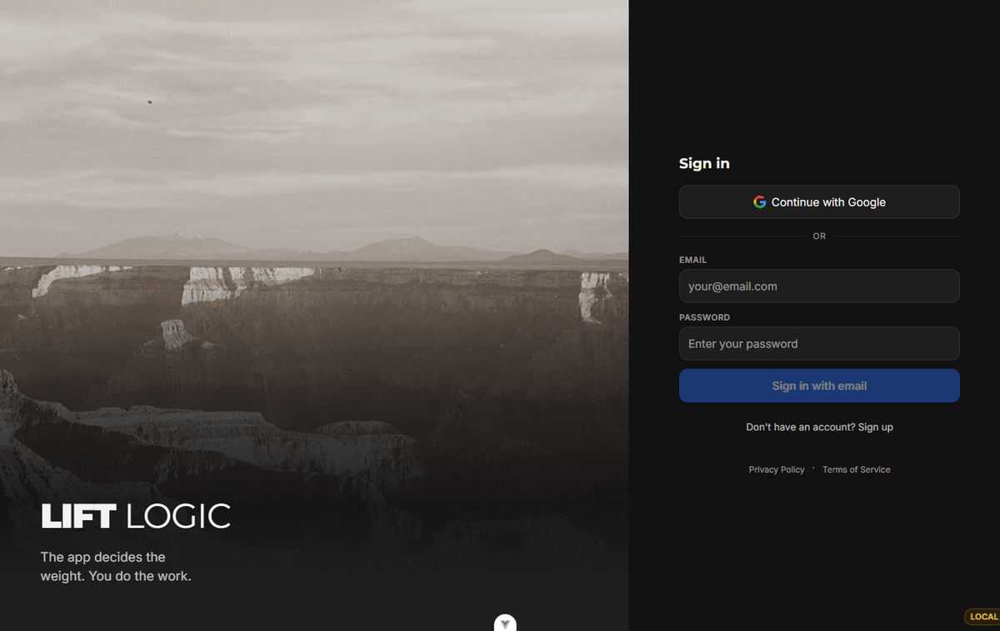
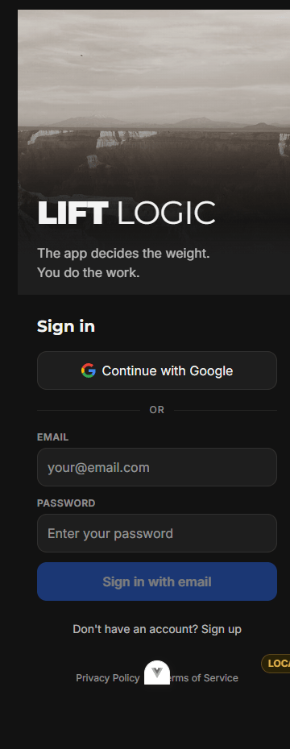
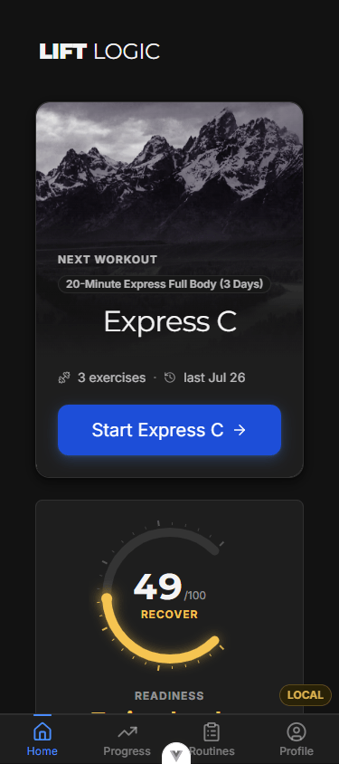
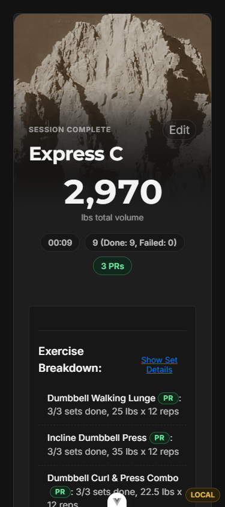
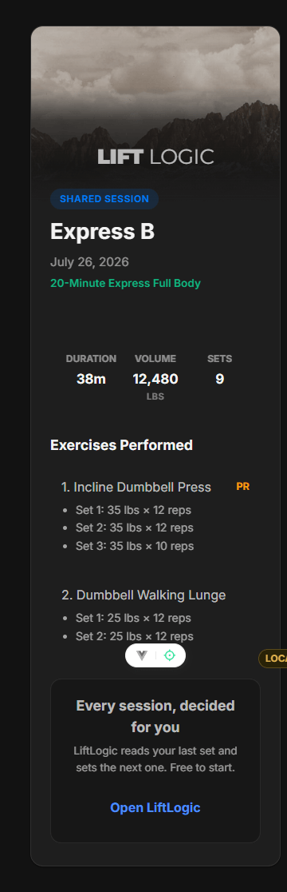
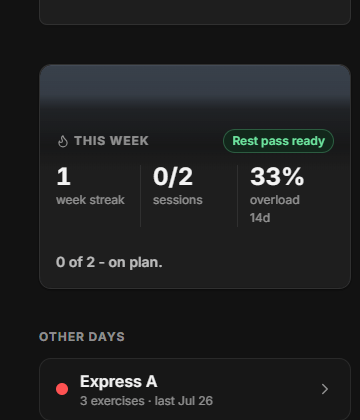
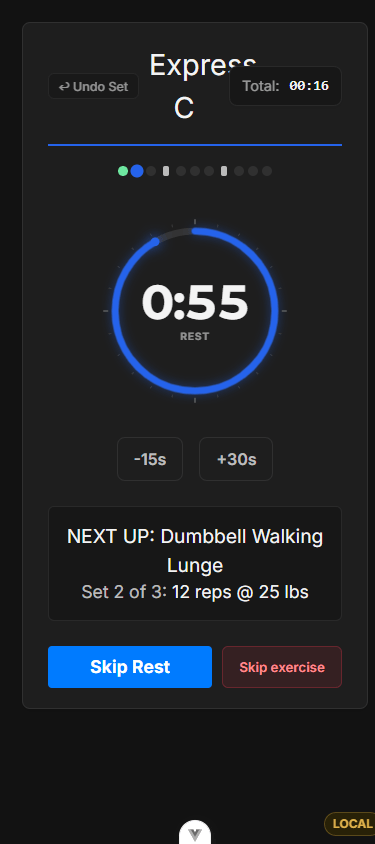

# LiftLogic Pro - every screen, without installing anything

Real screenshots of the running app on branch `liftlogic-pro`, captured with Playwright
against the Firebase emulator. Mobile shots are 390px; desktop shots are 1440px.

If you'd rather click around than look at pictures, [HANDOFF-FOR-JONNY.md](../HANDOFF-FOR-JONNY.md)
has the five commands. Nothing here touches your repo, your Firebase project, or your data.

---

## Landing (logged out)

The page had no imagery at all and is what has to sell the product. Plate is
*Clouds - White Pass*, Kings River Canyon, 1936.

| Mobile | Desktop |
|---|---|
|  |  |

---

## Sign in

This was the only view never migrated to the design system - light cards in a dark app,
a generic "Login" heading, no wordmark. Plate is *Grand Canyon from the North Rim*, 1941.

Desktop splits rather than stacks. Stacked, the crown became roughly a 5:1 letterbox and
`object-fit: cover` cropped the near-square plate into a squashed band.

Two real defects this surfaced, both fixed:

- The Google mark was fetched from `upload.wikimedia.org` **on every page load** - a
  third-party request on the sign-in screen that fails offline. Now an inline SVG.
- Chrome paints autofilled inputs `#e8f0fe` and ignores `background-color`, so anyone with
  saved credentials saw two white boxes in a dark app.

---

## Home

Plate is *The Tetons and the Snake River*, 1942 - the frame NASA put on the Voyager Golden
Record. The readiness gauge below it is the differentiator: rest gap, week progress, real
fail rate, volume trend and stalled-lift streaks fused into one score and a plain-language
call, with "Show the work" to expand the factors.

---

## Completion seal

The payoff moment gets the strongest image in the set: *Mt. Winchell*, Kings River Canyon,
1936, graded warm when the session set a personal record and cool when it didn't.

---

## Share card

The only surface a stranger ever sees. Plate is *North Palisade from Windy Point*, 1936.
Renders logged-out, which is the point.

---

## Two surfaces that were built and killed

Both were wired up, cut, and looked at before being reverted. Recorded here so the absence
reads as a decision rather than an oversight.

**Week strip.** The card is 171px tall, leaving roughly a 35px band above the statistics.
No photograph reads as a photograph at 35px - what shipped to this screenshot is not a
mountain, it's a faint grey-blue gradient that looks like a rendering bug, and it competed
with the hero directly above it.

**Rest screen.** A working instrument - the countdown is read at arm's length, mid-set, in
a gym. The ring already carries a glow and the layout has no spare room. Ambience behind it
costs legibility of the one number that matters. Shown here as it ships, unchanged.

---

## On the photographs

All four plates are from **National Archives series 79-AA** - Ansel Adams' 1941-42 National
Park Service commission. Adams stated in a 1942 letter that the photographs are US
Government property, so NARA publishes the whole series as public domain: no fee, no
attribution requirement, no third-party rights, no model releases.

The sources are black-and-white, so a single download covers every readiness band - the
band is applied as a CSS colour grade rather than a separate image per state. AVIF with
WebP fallback, 34-54KB each, lazy, never blocking first paint. Text never sits on a
photograph: the scrim resolves to flat surface before any copy starts. Worst measured
contrast across all four surfaces is **9.86:1** against a 4.5:1 requirement, sampled from
composited screenshot pixels rather than read off the CSS.

`scripts/make-vista.mjs` reproduces any plate from its source.

**This is a taste, and it's your call.** The app now reads heritage and reverent rather
than contemporary-athletic. If you don't want it: drop the `plate` prop from `<Vista>` and
the owned SVG ridgeline world returns, one line per surface, no other change.
